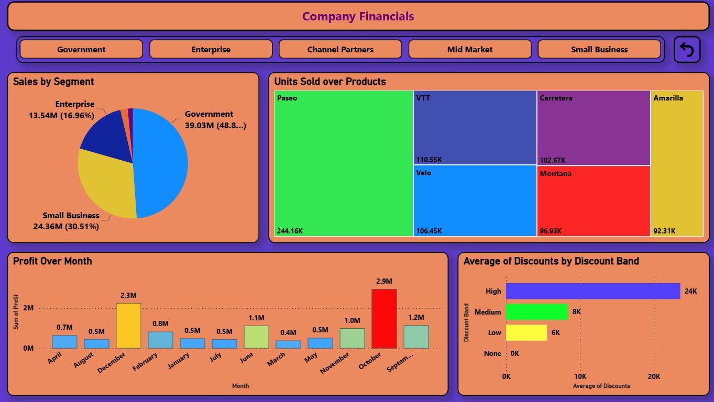

# Company Financial Analysis Dashboard – Power BI

## Project Overview

An interactive Power BI dashboard developed to analyze company financial performance and provide meaningful business insights through data visualization.

## Tools & Technologies

- Microsoft Power BI
- Power Query
- DAX
- Data Modeling

## Key Features

- KPI cards for key financial metrics
- Interactive financial visualizations
- Slicers and filters for dynamic analysis
- Analysis of sales and profit performance
- Interactive dashboard navigation

## Dashboard Preview

### Page 1

### Page 2

### Page 3

### Page 3

## Skills Demonstrated

- Data Cleaning & Transformation
- Data Visualization
- DAX
- Power Query
- Data Modeling
- Dashboard Design
